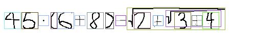

# Xfinity 

Small program used to make computer generated math datasets.

Datasets are generated from handwritten symbol databaes HASYv2 that you can find [here](https://www.kaggle.com/guru001/hasyv2).

## Usage

Clone the project and run from command line with these arguments:

<table>
    <tr>
        <th>Command</th>
        <th>Description</th>
    </tr>
    <tr>
        <td>--help</td>
        <td>Show help</td>
    </tr>
    <tr>
        <td>--dims <width>x<height></td>
        <td>Generate images with specified width and height (ex. 260x48)</td>
    </tr>
    <tr>
        <td>--color <color></td>
        <td>Sets background color, same for all the images, note color must be a hex number</td>
    </tr>
    <tr>
        <td>--size <size></td>
        <td>Defines the number of train images created for each formula provided</td>
    </tr>
    <tr>
        <td>--path <path></td>
        <td>The path where you want to save the dataset to</td>
    </tr>
    <tr>
        <td>--formula [formulas]</td>
        <td>Provide a list of formulas you want to create datasets from</td>
    </tr>
</table>

All images are randomly shifted with specified width, and have a random gray background.

Xfinity creates both the train and test datasets, the folder structure is shown bellow:

    .
    ├── ...
    ├── test                # test images                
    │   ├── 2+3             # formula              
    │   │   ├── 0.jpg       # image
    │   │   ├── 0.xml       # bounding boxes for specified image
    │   │   └── ...      
    │   └── ...
    ├── train               # train images
    │   ├── 2+3                  
    │   │   ├── 0.jpg
    │   │   ├── 0.xml        
    │   │   └── ...      
    │   └── ...
    └── ...

## Boundg boxes structure

Each image is accompanied by its xml. Xml file contains formula, name of the image file and bounding box for each element.

Here is an example of xml file

```
<annotation>
	<formula>2+3</formula>
	<filename>0.jpg</filename>

	<objects>
		<object>
			<name>2</name>
			<bbox>
				<xmin>48</xmin>
				<ymin>19</ymin>
				<xmax>80</xmax>
				<ymax>51</ymax>
			</bbox>
		</object>
		<object>
		...
	</objects>
</annotation>
```

## Examples

Here are some sample images with marked bounding boxes.




## Roadmap

At the time of the writing, there are a lot of features missing that are planned to be implemented in the future and there are also some small bugs.

The main features that will be implemented in the future are sum symbol, integral, limes, n-th root and n-th power.

Also, there are some additional features planned, like simulating more natural backgrounds, cleaning the dataset used to generate these formulas and more.